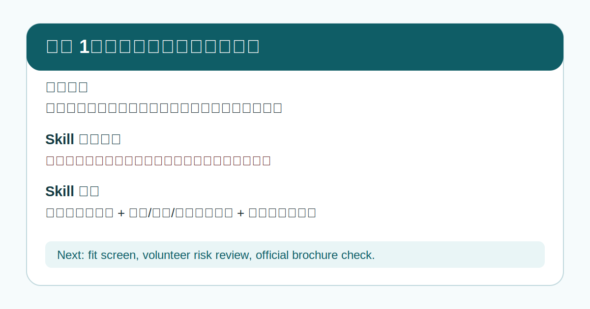
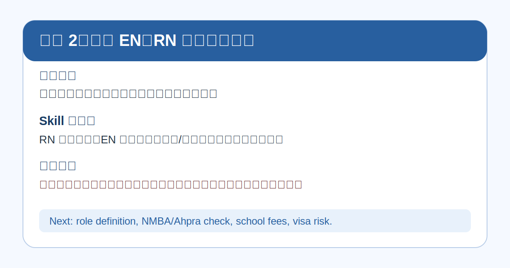
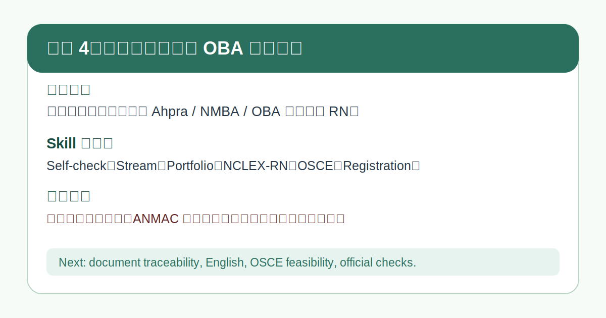

# SNP Skill

Shawn Nursing Pathway 的中文优先护理选择、学习、职业与路径智能体套件。它希望缩小护理信息差，让护理学子从选专业、学习、实习、升学到求职和海外注册，都能更早看见值得争取的方向和需要完成的准备。
A Chinese-first modular AI skill suite for nursing choices, learning, careers, and pathway screening.

公开名称是 **SNP Skill**。为兼容已有安装、GitHub 链接和更新路径，主 Skill 的稳定技术 ID 仍为 `shawn-nursing-pathway`。

## 一句话说明

面向中国普通家庭和护理学子，把分散的升学、英语、实习、执照、岗位、薪资和海外路径信息整理成一套可以持续使用的路径工具。

English: A Codex skill for nursing education, gaokao nursing fit, and overseas nursing pathway screening.

## 1 分钟使用 / Start in 1 Minute

不懂 Skill、Prompt、RAG 或工作流也可以使用。先选一个文件：

**第一次使用，先看 [`SNP Skill 新手入门`](docs/新手入门.md)；想看图示步骤，再打开 [`1 分钟上手指南 PDF`](docs/SNP-Skill-1分钟上手指南.pdf)。**

| 你在哪里使用 | 最简单的入口 |
|---|---|
| 手机豆包、千问或其他普通 AI 对话 | 下载并上传 [`Lite 中文单文件`](dist/shawn-nursing-pathway-lite.md) |
| 扣子、Dify、FastGPT、MaxKB、百炼等工作台 | 用 Lite 文件做角色指令，上传 [`Full 知识库单文件`](dist/shawn-nursing-pathway-full.md) |
| WorkBuddy / 腾讯云智能体开发平台 | 上传 [`WorkBuddy Skill ZIP`](dist/shawn-nursing-pathway-workbuddy.zip) |
| Codex | 安装 [`完整 SNP Skill 套件`](skills/) 或下载 [`Suite ZIP`](dist/shawn-nursing-pathway-suite.zip) |

完整的平台步骤见 [`QUICKSTART.md`](QUICKSTART.md)。

GitHub `main` 分支是公开发行真源。固定链接始终指向仓库当前版本；已经下载或上传到第三方平台的文件属于版本快照，需要在仓库更新后重新同步。

## SNP Skill 模块 / Modules

普通用户只调用主入口 **SNP Skill**，不需要记住下面的名字。主路由会按问题调用：

| 模块 | 负责什么 |
|---|---|
| SNP Fit | 护理适配与真实工作条件初筛 |
| SNP Explore | 国内外路径筛选与比较 |
| SNP Plan | 选定方向后拆阶段，并给本轮唯一最小任务 |
| SNP Learn | 护理知识、职业英语和路径知识逐步学习 |
| SNP Career | 岗位、工作场景、转行成本和薪资现实 |
| SNP Interview | 真实 JD、简历证据、申请和面试准备 |
| SNP Verify | 当前政策、学校、费用、招聘、薪资和机构说法核验 |

支持长期迭代不等于平台拥有永久记忆。平台无法保留历史时，使用 `SNP 进度卡` 续接。

## 图文案例 / Illustrated Cases

这些案例展示真实用户会如何使用这个 Skill。案例是中文优先，中英文配套。

### 案例 1：高考家长问护理能不能报



完整案例：[`examples/case-01-gaokao-nursing-fit.md`](examples/case-01-gaokao-nursing-fit.md)

### 案例 2：澳洲登记护士、注册护士和护工有什么区别



完整案例：[`examples/case-02-australia-en-rn-care-worker.md`](examples/case-02-australia-en-rn-care-worker.md)

### 案例 3：日本护理和介护有什么区别


完整案例：[`examples/case-03-japan-nursing-caregiving.md`](examples/case-03-japan-nursing-caregiving.md)

### 案例 4：中国护士问澳洲 OBA / Ahpra / NMBA 注册路径



完整案例：[`examples/case-05-australia-oba-iqnm.md`](examples/case-05-australia-oba-iqnm.md)

## 适用场景 / Use Cases

- 高考志愿里是否选择护理
- 护理适配度初筛
- 国内专科、本科、中外合作路径比较
- 菲律宾/宿务、日本、德国、美国 RN、澳洲、欧洲等护理路径初筛
- 中国护士、护理毕业生或已有海外注册背景者咨询澳洲 Ahpra/NMBA/OBA 路径
- 日本护士、护理留学、介护/SSW nursing care 路径分流
- 志愿方案复核
- 学校、费用、机构话术核验
- 具体职业、岗位或工作场景的当前薪资现实核验
- 用户面对家庭分歧或路径冲突时进行多视角分析
- 选定方向后把大计划拆成一个可执行、可验证的下一步
- 一步一步学习护理知识、职业英语或岗位沟通
- 护理临床转岗、相关行业、岗位要求与面试准备

English:

- Whether to choose nursing in gaokao volunteer planning
- First-pass nursing fit assessment
- Domestic junior-college, bachelor, and Sino-foreign nursing pathway comparison
- First-pass screening for Philippines/Cebu, Japan, Germany, US RN, Australia, Europe, and other nursing-related pathways
- Australia Ahpra/NMBA OBA registration screening for internationally qualified nurses
- Japan nurse, nursing study, caregiving, and SSW nursing care triage
- Volunteer plan review checklist
- School, tuition, and provider-claim verification
- Source-backed salary reality checks for specific roles and work settings
- Multi-perspective review for conflicted nursing decisions
- One-task-at-a-time planning after a direction is chosen
- Adaptive nursing knowledge and professional English learning
- Nursing career transition, job-description, and interview preparation

## 免责声明 / Disclaimer

本项目是公开信息整理、路径解释、适配度初筛和风险复核工具。它不做以下事情：

- 不预测录取结果
- 不输出最终志愿排序
- 不承诺录取、就业、个人薪资、签证、执照或移民
- 不代表官方、学校、雇主、机构或内部渠道
- 不替代考试院、学校官网、执照机构、移民部门或专业人士意见

用户应以考试院、学校官网、护理监管机构、执照机构、移民部门等官方最新文件为准。

English: This project is an information-organization and risk-review tool. It does not predict admission, rank final volunteer choices, promise admission, employment, visas, licensure, or immigration outcomes, or represent any official body, school, employer, agency, or internal channel.

## Codex 安装方式 / Install for Codex

将完整 SNP Skill 套件复制到本地 Codex skills 目录：

```bash
cp -R skills/shawn-nursing-* ~/.codex/skills/
```

也可以下载并解压 [`Suite ZIP`](dist/shawn-nursing-pathway-suite.zip)，再把其中 `skills/` 下的目录放进 Codex 支持的 skills 目录。

安装后请重启 Codex，或开启新会话以刷新技能列表。

## 非 Codex 平台使用 / Use Outside Codex

这个仓库不只服务 Codex。

- Codex 用户使用完整 `skills/` 套件；主入口仍是 `$shawn-nursing-pathway`
- 普通聊天用户优先使用 `dist/shawn-nursing-pathway-lite.md`
- 知识库平台优先使用 `dist/shawn-nursing-pathway-full.md`
- 需要自行组合的高级用户使用 `universal/`
- 平台适配说明见 `adapters/`
- 国内 AI 平台可以把本仓库当作“护理路径智能体提示词包”，而不是只当 Codex Skill

不承诺所有平台都能一键导入。不同平台对系统提示词、知识库、工作流、工具调用和检索配置的支持不同。

当平台支持独立 Agent 时，可以执行多视角并行分析；不支持时必须明确标注为“单模型多视角模拟”。

English:

- Codex users should install the complete `skills/` suite and invoke `$shawn-nursing-pathway` as the main router.
- Other AI platform users can use the files in `universal/`.
- Platform-specific adaptation notes are in `adapters/`.
- Domestic AI platforms can treat this repository as a nursing-pathway agent prompt package.

## 使用示例 / Example Prompts

```text
孩子高考分数一般，护理能不能报？
```

```text
菲律宾宿务护理路径值得了解吗？
```

```text
日本护理和介护有什么区别？
```

```text
国内护士想去日本做护士，是先学日语还是先看 MHLW 受验资格认定？
```

```text
中介说包就业包移民可信吗？
```

```text
澳洲护理学校和学费应该怎么查？
```

```text
我是国内注册护士，想通过澳洲 OBA 去做 RN，第一步该核实什么？
```

```text
有人说学 PTE、拿澳洲护工证、参加养老院面试以后可以走雇主担保，这个套餐要核验哪些证据？
```

```text
我已经暂定澳洲方向，今天只给我一个能完成的下一步，不要一次列全年计划。
```

```text
我想一步一步练国际医院护士交班英语，先测我现在的水平，再给第一课。
```

```text
我不想一直做临床，看到一个医疗器械临床培训岗位。先帮我拆真实工作和准入差距，再准备面试。
```

```text
如果最后成为澳洲 RN，在悉尼私立医院做全职护士，当前大概是什么薪资水平？请区分税前基本工资、夜班和加班，不要只给一个漂亮数字。
```

```text
家长想让我报护理，我不太愿意。先推荐 4 个互不重复的分析视角，等我确认后再开始。
```

## 文件结构 / Repository Structure

```text
shawn-nursing-pathway/
├── README.md
├── QUICKSTART.md
├── release.json
├── LICENSE
├── .gitignore
├── docs/
│   ├── 新手入门.md
│   └── SNP-Skill-1分钟上手指南.pdf
├── dist/
│   ├── shawn-nursing-pathway-lite.md
│   ├── shawn-nursing-pathway-full.md
│   ├── shawn-nursing-pathway-workbuddy.zip
│   ├── shawn-nursing-pathway-suite.zip
│   └── manifest.json
├── assets/
│   └── case-cards/
│       └── ...
├── examples/
│   ├── README.md
│   └── case-*.md
├── skills/
│   ├── shawn-nursing-pathway/        # SNP Skill 主路由
│   ├── shawn-nursing-fit/            # SNP Fit
│   ├── shawn-nursing-path-explorer/  # SNP Explore
│   ├── shawn-nursing-path-planner/   # SNP Plan
│   ├── shawn-nursing-learning/       # SNP Learn
│   ├── shawn-nursing-career/         # SNP Career
│   ├── shawn-nursing-job-readiness/  # SNP Interview
│   └── shawn-nursing-verify/         # SNP Verify
├── universal/
│   ├── system-prompt.md
│   ├── knowledge-base.md
│   ├── workflow.md
│   ├── output-templates.md
│   ├── safety-boundary.md
│   └── quick-start-cn.md
└── adapters/
    ├── README.md
    ├── workbody.md
    ├── doubao.md
    ├── qwen.md
    ├── coze.md
    ├── dify.md
    ├── fastgpt.md
    ├── maxkb.md
    ├── bailian.md
    └── generic-agent.md
```

## 版本与更新 / Versions and Updates

- 当前公开版本见 [`release.json`](release.json)。
- 发行文件哈希和固定 URL 见 [`dist/manifest.json`](dist/manifest.json)。
- `scripts/build_distribution.py` 从仓库当前源文件重新生成 Lite、Full、WorkBuddy ZIP 和完整 Suite ZIP，避免平台包各自分叉。
- `scripts/build_quickstart_pdf.py` 从当前公开版本信息重新生成 1 分钟上手 PDF。
- GitHub 能保证固定 URL 指向最新提交，但不能主动替换第三方平台里已经上传的旧文件。

## 公开安全说明 / Public Safety

本仓库不包含 Shawn 工作台私人文件、私人生活信息、内部服务设计、未确认学校合作关系或商业内部资料。

如果真实部署中存在学校、雇主、机构、代理、佣金、服务费或合作关系，应向用户透明披露。本仓库本身不验证、暗示或代表任何此类关系。

This project does not constitute legal, immigration, education, medical, psychological, career, or financial advice, and it does not provide any admission, employment, visa, license, or immigration guarantee.
