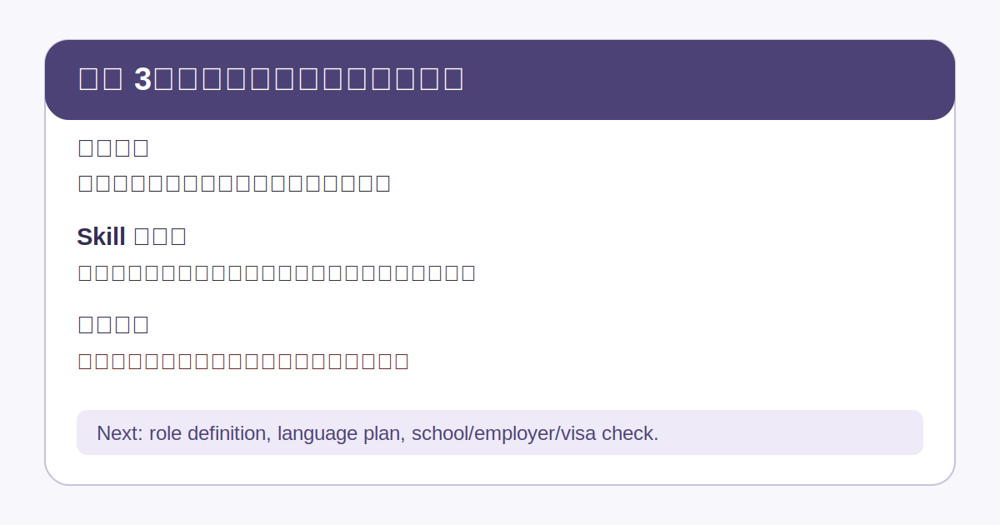

# 案例 3：日本护理和介护有什么区别



## 用户原话

```text
日本护理和介护有什么区别？是不是先去介护就能转护士？
```

## Skill 路由

进入：

- 日本护理/介护路径区分
- 语言门槛核验
- MHLW 护士国家考试受验资格认定路径
- SSW nursing care / 介护路径
- 角色、考试、雇主、签证和长期路径拆解

不直接进入：

- 日本就业承诺
- 转护士承诺
- 移民承诺
- 学校/机构/雇主推荐

## 建议回答

```markdown
## 边界提醒
我可以帮你解释日本护士、护理留学、介护和 SSW nursing care 的区别，以及需要核实的官方条件，但不能承诺录取、就业、签证、护士国家考试、护士执照、注册或长期居留结果。

## 初步判断
日本这里至少要先拆成三条：

1. 日本护士路径：如果你已经有外国护理教育和护士执照背景，要先看 MHLW 的受验资格认定，再谈护士国家考试和后续执照。
2. 护理留学/学校路径：先读书或语言，只是教育层；毕业不自动等于护士执照、就业或签证。
3. 介护/SSW nursing care：这是照护/介护工作方向，不是日本护士执照路径。

## 主要风险
- 不能把“先去介护”简单等同于“以后能转护士”。
- 对护士路径来说，日语和材料审查是核心门槛；对 SSW 来说，技能/日语测试也不等于工作或签证。
- 学校、考试资格、护士国家考试、雇主、COE、签证和长期居留是不同问题。

## 下一步要核实
- 你说的是日本护士、护理学校、介护福祉士，还是 SSW nursing care。
- 如果想做日本护士：你的护理学历、外国护士执照、N1/日语、成绩单/课程/执照材料是否可追溯。
- 如果想走介护/SSW：是否能接受身体照护、老人照护、轮班和日语工作环境。
- 官方核验：MHLW 受验资格认定页面、出入国在留管理厅 SSW 介护页面、Prometric 介护考试页面。

## 下一步建议
- 先区分护士、护理留学、介护/SSW 三条路。
- 再评估日语学习周期。
- 最后核验学校/雇主/签证文件。
```

## English Summary

The skill should separate Japan's nurse route, nursing study route, and caregiving/SSW nursing care route. It should make MHLW nurse exam eligibility, role definition, language, employer, Certificate of Eligibility, visa, and residence layers explicit, and it should not imply that caregiving automatically converts into a nursing license.
