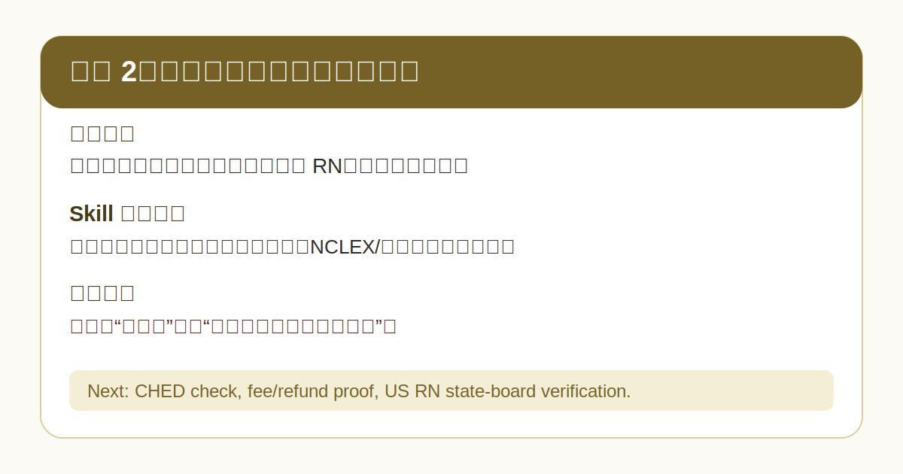

# 案例 4：菲律宾宿务护理和机构承诺核验



## 用户原话

```text
有机构说菲律宾宿务读护理，以后可以去美国 RN，还能安排就业，这个靠谱吗？
```

## Skill 路由

进入：

- 菲律宾/宿务路径初筛
- 学校和项目官方核验
- 机构话术核验
- 美国 RN 下游条件拆解

不直接进入：

- 机构推荐
- 学校排名
- 就业或移民承诺

## 建议回答

```markdown
## 边界提醒
我可以帮你拆解这类说法的风险，但不能替机构背书，也不能承诺录取、就业、美国 RN、签证或移民结果。

## 初步判断
这句话至少混在一起了五层：

1. 菲律宾学校和 BS Nursing 项目是否被官方认可。
2. 外国学生能否完成课程、临床要求和毕业要求。
3. 这个学历以后能否被美国目标州护理委员会接受。
4. NCLEX、英语、credential evaluation、VisaScreen 等要求。
5. 就业、雇主、签证和移民层面的不确定性。

## 主要风险
- “读完能去美国 RN”不是一句话能成立的，需要看目标州护理委员会和 credential evaluation。
- “安排就业”必须看雇主、合同、签证路径和失败责任。
- 如果机构不披露学校合作、佣金、退款规则和失败后的责任边界，风险很高。

## 下一步要核实
- 学校和项目是否能在 CHED 或学校官方渠道核实。
- 学费、住宿、签证、退款、临床费用是否有正式文件。
- 机构是否书面披露合作关系、佣金和就业推荐边界。
- 美国目标州 Board of Nursing 对该学历的要求。

## 下一步建议
- 先做机构话术逐句拆解。
- 再做菲律宾学校/项目官方核验。
- 最后做美国 RN 下游资格核验。
```

## English Summary

The skill should split the provider claim into education, graduation, licensing, job, visa, and immigration layers. It should ask for official school, regulator, fee, refund, and downstream licensing evidence before the family pays or signs anything.
